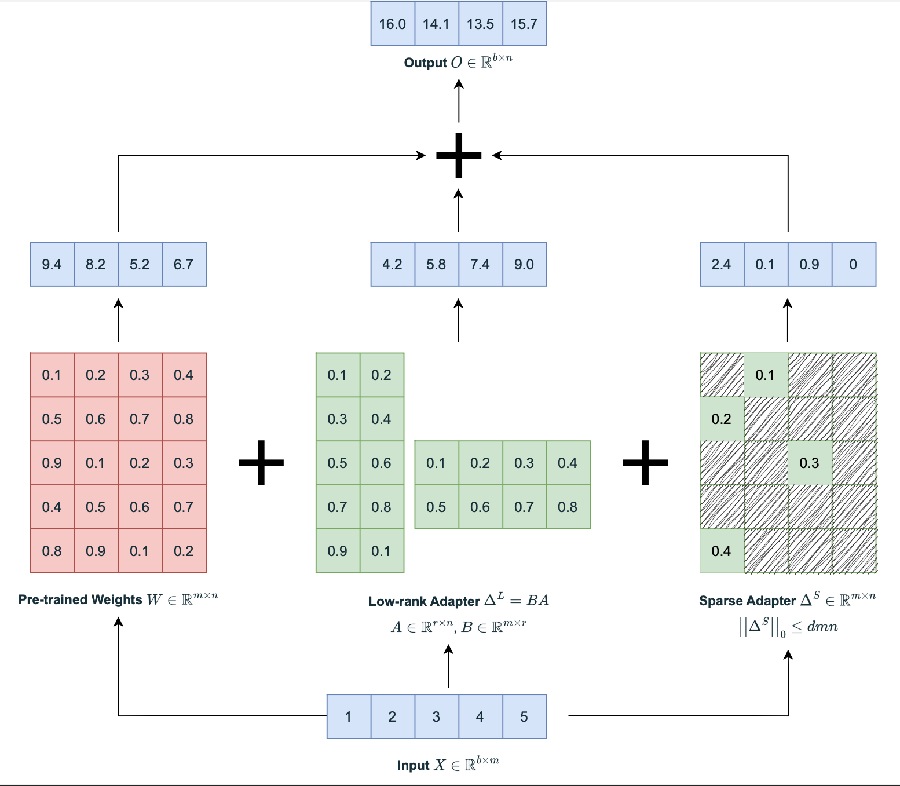
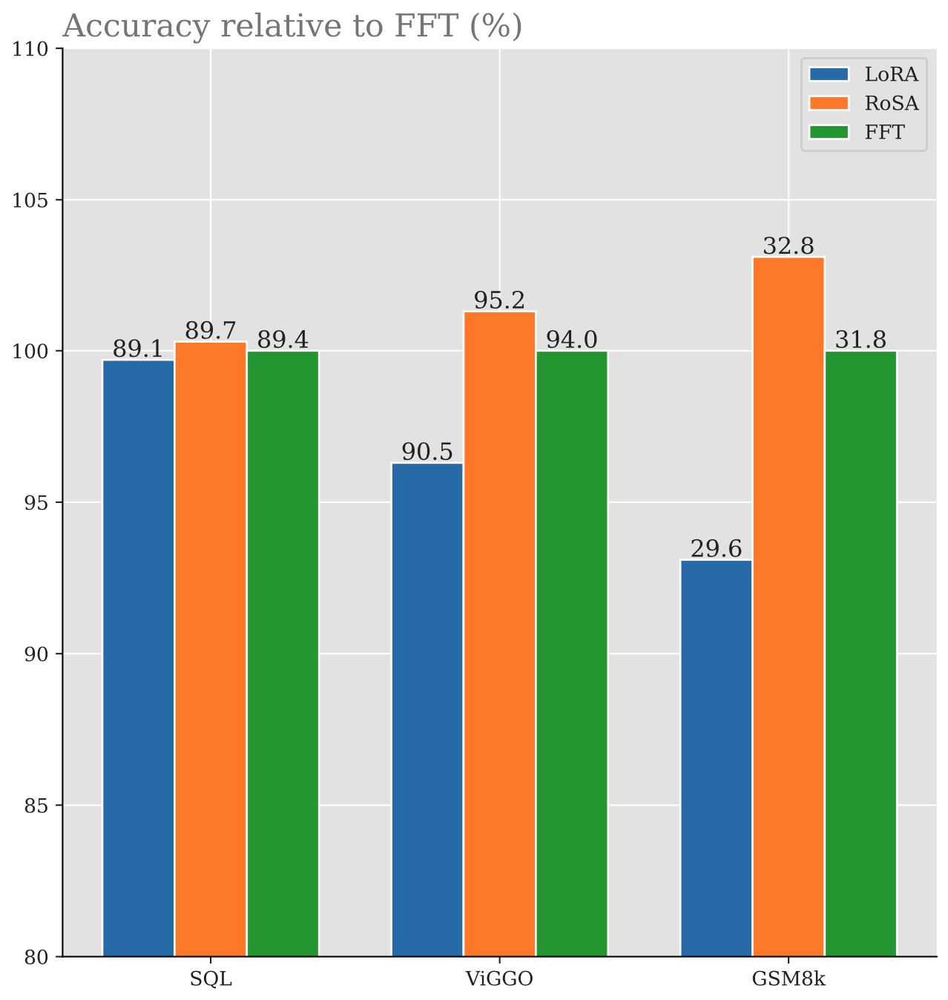

# RoSA: Robust Adaptation

Parameter-efficient fine-tuning via **RoSA** (Robust Adaptation), combining low-rank and sparse adapters.
Paper: [RoSA: Accurate Parameter-Efficient Fine-Tuning via Robust Adaptation](https://arxiv.org/abs/2401.04679).

<p float="left" align="middle">
  
  
</p>

## What's new on `refactor`

This branch replaces the MosaicML Composer / llm-foundry stack with:

- **[HuggingFace Transformers](https://github.com/huggingface/transformers)** + **[TRL](https://github.com/huggingface/trl)** for SFT
- **[peft-rosa](https://github.com/soroush-tabesh/peft-rosa)** (`rosa-tuner` branch, git submodule) for RoSA adapters
- **[spops](https://github.com/IST-DASLab/spops)** (git submodule) for sparse kernels backing the RoSA sparse adapter
- **[uv](https://docs.astral.sh/uv/)** for reproducible installs (Python 3.11, PyTorch ≥2.10, CUDA 13.0)

Training uses a single `SFTTrainer` run with `peft.tuners.rosa.RosaScheduler`, which handles LoRA warmup, gradient-based mask generation, and sparse adapter activation.

The ICML 2024 submission code is preserved in [`legacy/`](legacy/) and on the **`icml2024`** branch.

## Installation

**Prerequisites:** Python 3.11, CUDA 13.0 toolkit (`nvcc`) and a C++ compiler for building spops, [uv](https://docs.astral.sh/uv/).

```bash
git clone git@github.com:IST-DASLab/RoSA.git
cd RoSA
git checkout refactor
git submodule update --init --recursive
cd third_party/peft-rosa && git checkout rosa-tuner && cd ../..

uv sync
```

`peft` is installed in editable mode from `third_party/peft-rosa`. To develop the tuner, commit inside that submodule and push to [peft-rosa](https://github.com/soroush-tabesh/peft-rosa), then bump the submodule SHA here.

> **SSH note:** If `git submodule` prompts for your SSH key passphrase, unlock your agent first (`ssh-add`) or use HTTPS remotes locally.

## Quickstart

Train **Llama-3.2-3B-Instruct** on MetaMathQA:

```bash
bash examples/llama3_metamath/run.sh
```

Train **Qwen3.5-9B** on MetaMathQA:

```bash
bash examples/qwen_metamath/run.sh
```

Evaluate on GSM8K / MATH:

```bash
uv run rosa-eval --model meta-llama/Llama-3.2-3B-Instruct \
  --adapter ./outputs/llama3_metamath --benchmark gsm8k --max-samples 100

uv run rosa-eval --model meta-llama/Llama-3.2-3B-Instruct \
  --adapter ./outputs/llama3_metamath --benchmark math --max-samples 50
```

Or use a YAML config directly:

```bash
uv run rosa-train --config examples/llama3_metamath/config.yaml
```

## Project layout

```
src/rosa/          # Training, data, eval
examples/          # Llama-3.2 and Qwen3.5 MetaMathQA recipes
third_party/
  peft-rosa/       # RoSA PEFT integration (upstream PR: rosa-tuner branch)
  spops/           # Sparse ops kernels (built from source)
legacy/            # ICML 2024 llm-foundry code
```

## Upstream PEFT PR

RoSA is integrated in `third_party/peft-rosa` on the **`rosa-tuner`** branch, following the [PEFT contributing guide](https://huggingface.co/docs/peft/main/en/developer_guides/contributing). Open a draft PR from `soroush-tabesh/peft-rosa:rosa-tuner` → `huggingface/peft:main` when ready.

## Citation

```bibtex
@article{nikdan2024rosa,
  title={RoSA: Accurate Parameter-Efficient Fine-Tuning via Robust Adaptation},
  author={Nikdan, Mahdi and Tabesh, Soroush and Crnčević, Elvir and Alistarh, Dan},
  journal={arXiv preprint arXiv:2401.04679},
  year={2024}
}
```
