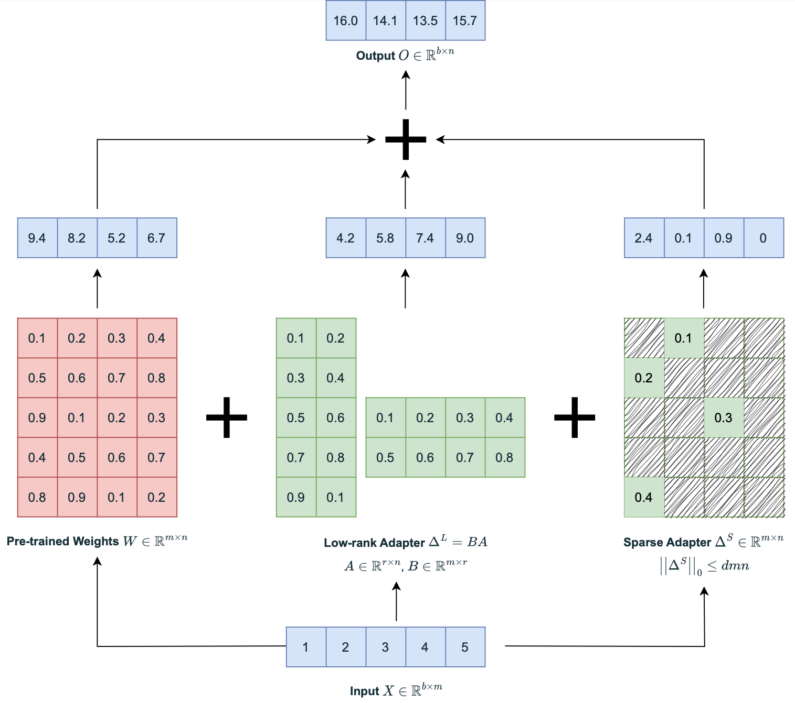

# Robust Adaptation (RoSA)

This repository includes the code for the paper ["RoSA: Accurate Parameter-Efficient Fine-Tuning via Robust Adaptation"](https://arxiv.org/abs/2401.04679). Below you find an illustration of RoSA and a brief comparison with Full Fine-Tuning (FFT) and Low-Rank Adaptation (LoRA).

<p float="left" align="middle">
  
   
</p>


## Installation
1. Create a clean environment and activate it:
```
conda create --name rosa python=3.10 -y
conda activate rosa
```

2. Install a version of [pytorch](https://pytorch.org/) (>=2.1.2) compatible with your CUDA (please use conda instead of pip to ensure all the dependencies are installed properly). For example, if you have CUDA version 11.8, run the following command:
```
conda install pytorch torchvision torchaudio pytorch-cuda=11.8 -c pytorch -c nvidia
```

3. Install this repository, which is a fork of [MosaicML's llm-foundry](https://github.com/mosaicml/llm-foundry) including the experiments presented in the paper:
```
git clone https://github.com/IST-DASLab/RoSA.git && cd RoSA
pip install -e .
```

4. Install the [*spops*](https://github.com/IST-DASLab/spops) library, which we use under the hood to perform sparse operations: 
```
pip install git+https://github.com/IST-DASLab/spops.git
```

5. Install [RoSA's integration into the PEFT library](https://github.com/IST-DASLab/peft-rosa) by running:
```
pip install git+https://github.com/IST-DASLab/peft-rosa.git
```

6. For evaluation, we use [lm-evaluation-harness](https://github.com/EleutherAI/lm-evaluation-harness). Run the following commands to install the compatible version:
```
git clone https://github.com/EleutherAI/lm-evaluation-harness.git
cd lm-evaluation-harness
git checkout 2c18e367c6ded428863cd1fd4cf9558ca49d68dc
pip install -e .
cd ..
```

## Quick Start

### Training
First things first, activate the environment and cd into `scripts/train/`
```
conda activate rosa
cd scripts/train/
```

To run quick experiments, simply run any of the following commands, each of which corresponds to one of the single-epoch experiments in the paper:

```
# best RoSA on gsm8k
CUDA_VISIBLE_DEVICES=0 bash scripts/llama2-7b/restart_7b_gsm_bf16.sh

# best RoSA on viggo
CUDA_VISIBLE_DEVICES=0 bash scripts/llama2-7b/restart_7b_viggo_bf16.sh

# best RoSA on sql
CUDA_VISIBLE_DEVICES=0 bash scripts/llama2-7b/restart_7b_sql_bf16.sh

# best QRoSA on gsm8k
CUDA_VISIBLE_DEVICES=0 bash scripts/llama2-7b/restart_7b_gsm_4bit.sh

# best QRoSA on viggo
CUDA_VISIBLE_DEVICES=0 bash scripts/llama2-7b/restart_7b_viggo_4bit.sh

# best QRoSA on sql
CUDA_VISIBLE_DEVICES=0 bash scripts/llama2-7b/restart_7b_sql_4bit.sh
```

Each training (without evaluation) should take around one hour. These scripts essentially run `scripts/restarter_llama2.sh` with different hyper-parameters. `scripts/restarter_llama2.sh` takes care of low-rank adapter warmup and restarting the training after mask generation. Feel free to tweak the hyper-parameters in any of these scripts.

### Evaluation
The training scripts will run the evaluation right after the training is finished and store the results in the `evals` folder. Look at the final few lines of `scripts/restarter_llama2.sh`.

Evaluation on ViGGO and SQL only take a few minutes. However, evaluation on GSM8k takes around 45 minutes for *bf16* models and 3 hours for *4bit* models (since merging the RoSA adapters in the *4bit* case is tricky, and the current version of the code does not support it).

## RoSA Results
Below is a comparison between Full Fine-Tuning (FFT), Low-Rank Adaptation (LoRA), Pure Sparse Adaptation (SpA), and Robust Adaptation (RoSA). The first table shows results for the case where the pre-trained parameters are stored in the *bf16* format, while the second one presents results for [4-bit double-qunatinzed pre-trained parameters](https://arxiv.org/abs/2305.14314).

<p align="center">

</p>

<p align="center">

</p>


## Citation
If you plan to use our work in your projects, please consider citing our paper:

```
@article{nikdan2024rosa,
  title={RoSA: Accurate Parameter-Efficient Fine-Tuning via Robust Adaptation},
  author={Nikdan, Mahdi and Tabesh, Soroush and Crnčević, Elvir and Alistarh, Dan},
  journal={arXiv preprint arXiv:2401.04679},
  year={2024}
}
```
